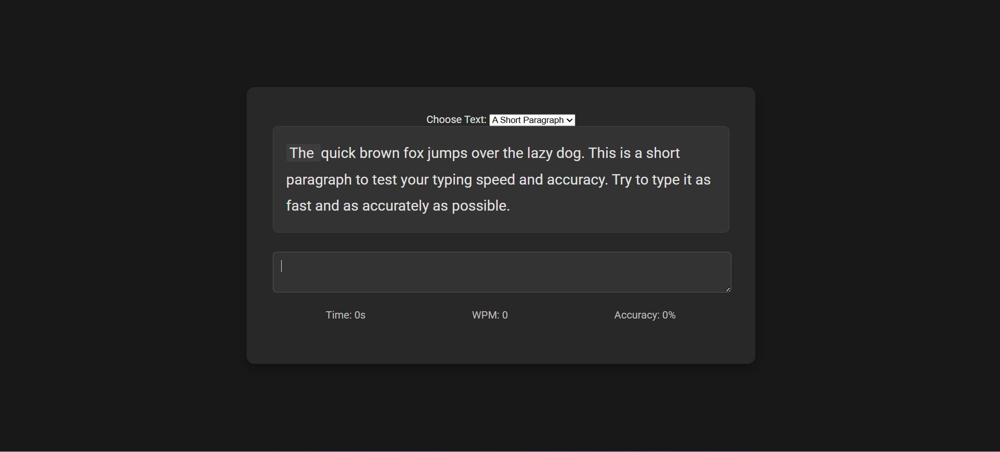

# Typing Speed Test Web Application

[]

## Overview

This is a web-based typing speed test application designed to help users measure their typing speed and accuracy. 
It provides a simple and interactive interface where users can type displayed text and receive real-time feedback on their words per minute (WPM) and accuracy.

## Key Features

 Selectable Text Options Users can choose from different text lengths (short words, common phrases, a short paragraph) to customize their test.
 Real-time Feedback Displays the timer, current WPM, and accuracy as the user types.
 Word Highlighting The current word being typed is visually highlighted.
 Typing Error Indication Incorrectly typed characters within the current word are highlighted.
 Detailed Results Upon completion, the application shows the final WPM and accuracy.
 Restart Functionality A button to easily restart the test with the same or a different text selection.

## Technologies Used

 HTML
 CSS
 JavaScript

## How to Run Locally

1.  Clone the repository to your local machine
    ```bash
    git clone https://github.com/nisch077/typing-test-webapp
    ```
2.  Navigate to the project directory
    ```bash
    cd typing-test-webapp
    ```
3.  Open the `more_texts\index.html` file in your web browser. The index.html in root opens a basic version of the typing test.

## Potential Future Enhancements

 Random sentence generation from a larger vocabulary.
 More advanced text selection options (e.g., different topics, difficulty levels).
 User accounts to track progress and history.
 More detailed error analysis in the results.
 Improved UIUX with better visual feedback and responsiveness.

## Author

Nischal Nagarkoti - https://github.com/nisch077